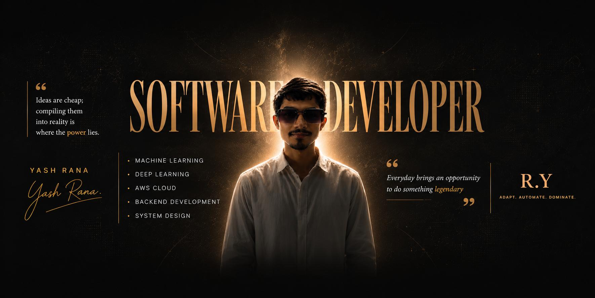

<div align="center">



<br>


<br><br>


</div>

---

<div align="center">

# ⚡ Welcome to My Digital Workspace


</div>

# 💫 About Me

```python
class YashRana:

    def __init__(self):

        self.name = "Yash Rana"

        self.role = "Software Developer"

        self.location = "India"

        self.interests = [

            "Machine Learning",

            "Deep Learning",

            "Backend Development",

            "AWS Cloud",

            "System Design"

        ]

        self.currently_learning = [

            "Generative AI",

            "Large Language Models",

            "Cloud Architecture"

        ]

        self.tools = [

            "Python",

            "FastAPI",

            "Flask",

            "Docker",

            "AWS"

        ]

    def motto(self):

        return "Adapt. Automate. Dominate."

developer = YashRana()

print(developer.motto())
```

---

### 👨‍💻 Who Am I?

- 💻 Passionate about building intelligent software
- 🤖 Exploring Artificial Intelligence & Deep Learning
- ☁️ Learning AWS Cloud & Cloud Native Development
- 🚀 Building projects that solve real-world problems
- 🌱 Constantly learning modern technologies
- 📚 Love contributing to Open Source
- ⚡ Always curious about new ideas
- 🎯 Goal: Build scalable AI-powered applications

---

## 🔥 Current Status

```text
Name      :: Yash Rana

Role      :: Software Developer

Focus     :: AI + Backend + Cloud

Learning  :: LLMs | AWS | System Design

Status    :: Building Projects 🚀

Motto     :: Adapt. Automate. Dominate.
```

---

<div align="center">

## ⚙️ Developer Console

</div>

```bash
> whoami

Yash Rana

> occupation

Software Developer

> interests

Machine Learning

Backend Development

AWS Cloud

Deep Learning

System Design

> currently_learning

Generative AI

LLMs

Cloud Architecture

> life

while(alive){
    Learn();
    Build();
    Improve();
    Repeat();
}
```

---

<div align="center">


</div>

## 🚀 My Philosophy

> **Ideas are cheap. Building them into reality creates impact.**
<div align="center">

# 🌐 Connect With Me

<p align="center">

<a href="https://www.linkedin.com/in/yash-rana-a18874293">

</a>

<a href="https://www.instagram.com/rana_yash_001">

</a>

<a href="https://discord.com/users/rana_yash_001">

</a>

</p>

</div>

---

<div align="center">


</div>

# 💻 Tech Stack

<div align="center">

## 👨‍💻 Programming Languages


</div>

---

<div align="center">

## ⚙️ Backend Development


</div>

---

<div align="center">

## 🗄️ Databases


</div>

---

<div align="center">

## ☁️ Cloud & DevOps


</div>

---

<div align="center">

## 🤖 Artificial Intelligence


</div>

---

# 🚀 Skills Overview

```text
🐍 Python                ████████████████████ 95%

🤖 Machine Learning      ██████████████████░ 90%

🧠 Deep Learning         █████████████████░░ 85%

⚙️ Backend Development   ██████████████████░ 90%

☁️ AWS Cloud             ███████████████░░░░ 75%

🐳 Docker                ███████████████░░░░ 75%

🗄️ Database Design       █████████████████░░ 85%

📦 Git & GitHub          ███████████████████ 92%

🧩 System Design         ██████████████░░░░░ 70%

🚀 Generative AI         █████████████░░░░░░ 65%
```

---

# 🛠 Technologies I Love Working With

<table align="center">

<tr>

<td align="center" width="150">

🐍

### Python

Automation

Machine Learning

Backend

</td>

<td align="center" width="150">

☁️

### AWS

Cloud

Deployment

Learning

</td>

<td align="center" width="150">

⚡

### FastAPI

REST APIs

Performance

Scalable Apps

</td>

</tr>

<tr>

<td align="center">

🧠

### AI

Deep Learning

Computer Vision

Research

</td>

<td align="center">

🐳

### Docker

Containers

Deployment

DevOps

</td>

<td align="center">

🗄️

### SQL

MySQL

PostgreSQL

MongoDB

</td>

</tr>

</table>

---

<div align="center">

## 💡 Favorite Quote

> "First, solve the problem. Then, write the code."

</div>

---

<div align="center">


</div>

> **Code. Learn. Build. Repeat.**

---

<div align="center">

### ⚡ Adapt • Automate • Dominate ⚡

</div>


---

# ⚡ GitHub Overview

| Metric | Status |
|---------|--------|
| 💻 Primary Role | Software Developer |
| 🤖 AI/ML | Machine Learning & Deep Learning |
| ☁️ Cloud | AWS Enthusiast |
| ⚙️ Backend | FastAPI • Flask • Django |
| 📦 Version Control | Git & GitHub |
| 🐳 Containerization | Docker |
| 🧠 Current Learning | Generative AI & LLMs |
| 🚀 Focus | Scalable AI Applications |

---

# 📅 Weekly Development Cycle

```text
Monday      ████████████████████
Tuesday     ███████████████████
Wednesday   ██████████████████
Thursday    ████████████████████
Friday      ███████████████████
Saturday    █████████████████████
Sunday      ███████████████
```

---

# 💻 Coding Philosophy

```python
while True:

    learn()

    build()

    debug()

    deploy()

    improve()

    repeat()
```

---

# 🎯 Development Goals

- ✅ Build impactful software
- ✅ Learn cutting-edge technologies
- ✅ Master Backend Development
- ✅ Become proficient in AWS Cloud
- ✅ Contribute to Open Source
- ✅ Build AI-powered applications
- ✅ Write clean and maintainable code
- ✅ Keep learning every single day

---

<div align="center">

# 🚀 Tech Journey

```text
Python          ████████████████████

Machine Learning ██████████████████░

Deep Learning    █████████████████░░

Backend           ██████████████████

AWS               ███████████████░░░

Docker            ███████████████░░░

System Design     █████████████░░░░░

Generative AI     ████████████░░░░░░
```

</div>

---

<div align="center">

## 💬 Developer Mindset

> **"Consistency beats intensity. Build something, learn something, improve something—every day."**

</div>

---

<div align="center">


</div>
<div align="center">

# 🚀 Featured Projects


*"Building practical solutions with AI, Backend Development, and Cloud technologies."*

</div>

---

<table>

<tr>

<td width="50%" valign="top">

## 🔍 Image Tamper Detection

> AI-powered image forgery detection system.

### ✨ Features

- Image forgery detection
- SSIM Analysis
- Feature Extraction
- OpenCV Processing
- Machine Learning Prediction
- Fast Image Comparison

### ⚙️ Tech Stack

`Python`

`OpenCV`

`NumPy`

`Machine Learning`

`Scikit-learn`

`Computer Vision`

### 📌 Status

🟢 Active Project

---

</td>

<td width="50%" valign="top">

## 🔐 Secure File Transfer System

> Secure file sharing platform with authentication.

### ✨ Features

- User Authentication
- Secure Upload
- Encrypted Transfer
- File Management
- Download Protection
- Efficient Storage

### ⚙️ Tech Stack

`Python`

`FastAPI`

`MySQL`

`HTML`

`CSS`

`JavaScript`

### 📌 Status

🟢 Completed

</td>

</tr>

</table>

---

<table>

<tr>

<td width="50%" valign="top">

## 🌱 Smart Irrigation System

> IoT-based automated irrigation solution.

### ✨ Features

- Soil Moisture Detection
- Automated Water Supply
- Smart Decision Making
- Water Saving
- Sensor Integration
- Real-time Monitoring

### ⚙️ Tech Stack

`Python`

`IoT`

`Sensors`

`Machine Learning`

### 📌 Status

🟢 Completed

</td>

<td width="50%" valign="top">

## 🌾 Crop Yield Prediction

> Predict crop production using ML.

### ✨ Features

- Yield Prediction
- Weather Analysis
- Soil Analysis
- Data Visualization
- ML Prediction
- Agricultural Insights

### ⚙️ Tech Stack

`Python`

`Pandas`

`Scikit-learn`

`Machine Learning`

### 📌 Status

🟢 Completed

</td>

</tr>

</table>

---

<table>

<tr>

<td width="50%" valign="top">

## 🍃 Crop Disease Detection

> Deep Learning based disease detection.

### ✨ Features

- Leaf Image Detection
- CNN Classification
- Disease Prediction
- Image Processing
- Early Diagnosis
- AI Automation

### ⚙️ Tech Stack

`Python`

`TensorFlow`

`CNN`

`OpenCV`

`Deep Learning`

### 📌 Status

🟢 Active

</td>

<td width="50%" valign="top">

## 🛒 E-Commerce Platform

> Full Stack Shopping Application.

### ✨ Features

- Authentication
- Product Catalog
- Shopping Cart
- Order Management
- Admin Panel
- Secure Payments

### ⚙️ Tech Stack

`Python`

`FastAPI`

`MySQL`

`HTML`

`CSS`

`JavaScript`

### 📌 Status

🟢 Completed

</td>

</tr>

</table>

---

<div align="center">

# 📈 Project Categories

| Category | Projects |
|----------|----------|
| 🤖 Artificial Intelligence | Image Tamper Detection, Crop Disease Detection |
| 🌱 Machine Learning | Crop Yield Prediction |
| 🌐 Backend Development | Secure File Transfer, E-Commerce Platform |
| ☁️ Cloud Computing | AWS Learning Projects |
| 📡 IoT | Smart Irrigation System |

</div>

---

# 💡 Development Principles

```text
✔ Clean Architecture

✔ Scalable Design

✔ Performance First

✔ Security Focused

✔ User Friendly

✔ Continuous Learning

✔ Problem Solving

✔ Modern Technologies
```

---

<div align="center">

## 🚀 Current Development Focus

🧠 Artificial Intelligence

☁️ AWS Cloud

⚙️ Backend Development

📦 REST APIs

🐳 Docker

🤖 Generative AI

</div>

---

<div align="center">


</div>
<div align="center">

# 🎯 Current Focus


</div>

<table>
<tr>

<td width="50%" valign="top">

## 🚀 Building

- 🤖 AI Powered Applications
- ⚙️ Backend APIs
- ☁️ AWS Cloud Projects
- 🧠 Machine Learning Models
- 📦 RESTful Services
- 🌍 Open Source Projects

</td>

<td width="50%" valign="top">

## 📚 Currently Learning

- Generative AI
- Large Language Models (LLMs)
- AWS Cloud Architecture
- System Design
- Docker & Deployment
- Advanced Backend Development

</td>

</tr>
</table>

---

# 🛣️ Learning Roadmap

```text
Python                ████████████████████ ✅

Data Structures       ███████████████████░

Machine Learning      ███████████████████░

Deep Learning         ██████████████████░░

Computer Vision       ██████████████████░░

Backend Development   ███████████████████░

FastAPI               ███████████████████░

Docker                ████████████████░░░░

AWS                   ███████████████░░░░░

System Design         █████████████░░░░░░░

Generative AI         ████████████░░░░░░░░

LLMs                  ██████████░░░░░░░░░░
```

---

# 🎓 Education

```text
🎓 Diploma in Computer Engineering

📍 UPL University of Sustainable Technology

💯 Academic Performance

⭐ 10 SPI

⭐ 10 CPI

⭐ Consistent Academic Excellence
```

---

# 💼 What I Enjoy Building

<table>

<tr>

<td align="center">

🤖

### Artificial Intelligence

Machine Learning

Deep Learning

Computer Vision

</td>

<td align="center">

⚙️

### Backend

REST APIs

Authentication

Databases

</td>

<td align="center">

☁️

### Cloud

AWS

Deployment

Containers

</td>

</tr>

</table>

---

# 📅 2026 Goals

- ✅ Master AWS Cloud
- ✅ Learn Advanced System Design
- ✅ Build More Open Source Projects
- ✅ Contribute to Developer Communities
- ✅ Explore Generative AI
- ✅ Improve Backend Development Skills
- ✅ Build Scalable AI Applications
- ✅ Keep Learning Every Day

---


<div align="center">

# ❤️ Thanks For Visiting

If you like my projects,

⭐ Star my repositories

🍴 Fork something interesting

🤝 Let's collaborate

📚 Let's learn together

</div>

---

<div align="center">

# 🌐 Let's Connect

<a href="https://www.linkedin.com/in/yash-rana-a18874293">

</a>

<a href="https://www.instagram.com/rana_yash_001">

</a>

<a href="https://discord.com/users/rana_yash_001">

</a>

</div>

---

<div align="center">

# 💬 Final Quote

### *"Ideas are cheap.*

### *Compiling them into reality is where the power lies."*

</div>

---

<div align="center">

## ⚡ Adapt • Automate • Dominate ⚡

<br>


</div>
